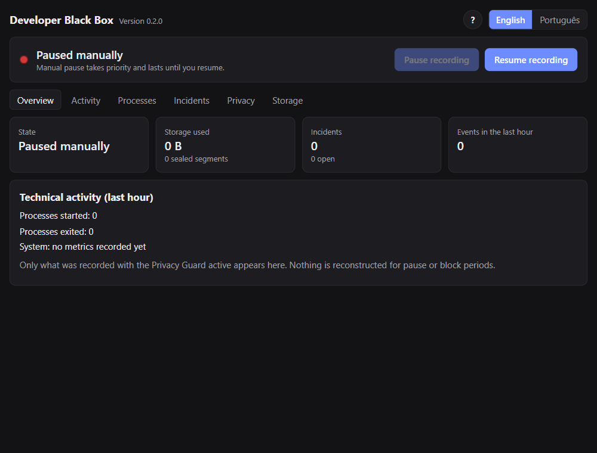
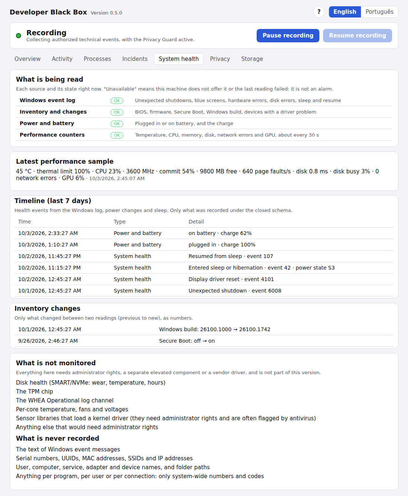
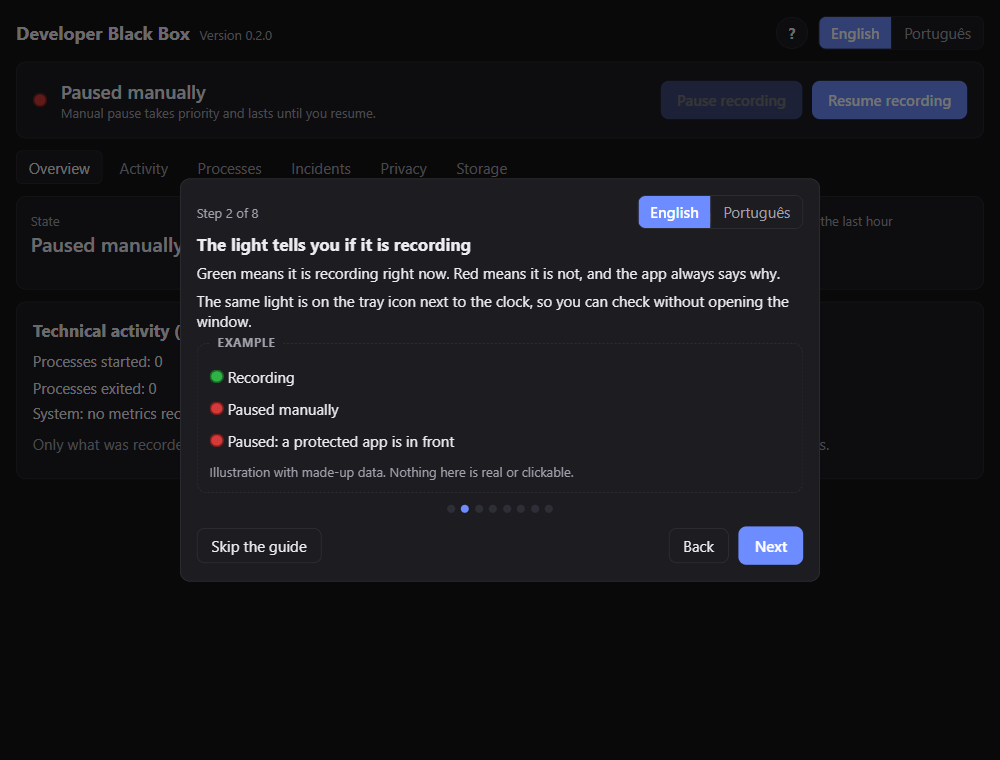
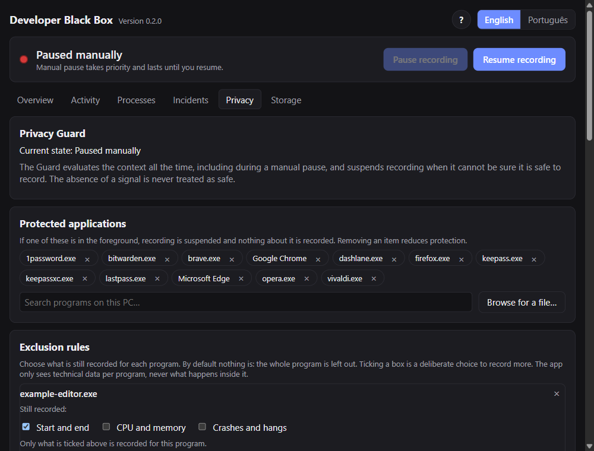
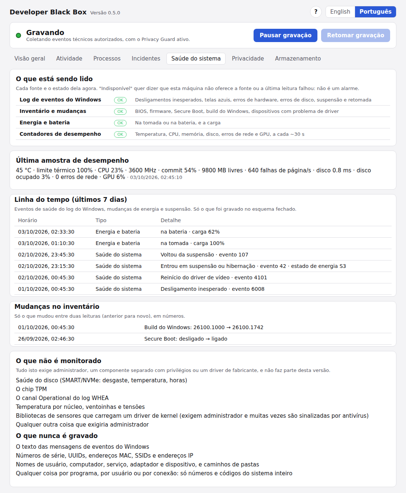

# Developer Black Box

**English** | [Português (Brasil)](#português-brasil)

A local "black box" for **Windows 11**: it records technical process events (start, exit, CPU,
memory, crashes and hangs), preserves incident evidence and helps you investigate software problems.
**Privacy first:** everything stays on your computer, encrypted, with no cloud, and the app never
captures passwords, typed text, page content, window titles, URLs, file paths or command lines.

**[Download the latest installer](https://github.com/GabrielVianaNunes/Developer-Black-Box/releases/latest)** · Windows 11 · free for noncommercial use



*Screenshots in this README show a fresh install with made-up data (example program names only). Nothing in them was recorded from a real computer.*

## What it does

- **Tray icon** (a black cube with a light beside it): green only when recording is actually active;
  red when paused, suspended by privacy rules or failing. The tooltip and the window explain why.
- **Pause and resume** from the tray, even with the window closed. Resuming never bypasses the
  Privacy Guard.
- **Privacy Guard:** suspends recording when a browser or password manager is in the foreground, the
  session is locked or the detector is unavailable. The absence of a signal is never treated as "safe".
- **Incidents:** manual capture, sustained CPU, high memory, crashes and hangs (Windows Event Log),
  with evidence from the window before and after. Optionally (off by default, Privacy tab: **"Notify me when an incident opens by itself"**),
  a Windows notification says **only the type** of an automatic incident, never a program name or any recorded data; it waits while a browser
  or password manager is in front, is dropped on a manual pause or after 30 minutes, and clicking it does not open the app.
  In the incident detail, **Copy summary** puts a short text on the clipboard (and shows it for you to check) to paste into a bug report: type,
  time, app and Windows build, nearby machine health events and the last performance sample. It is built from the same export, with today's
  privacy rules applied again, so it never has your notes, user or computer names, paths or message texts, and it names the program only if
  the export would.
- **System health:** a **System health** tab and automatic incidents (blue screen, unexpected shutdown, hardware error, sustained thermal
  throttling), fed by Windows events from a fixed list, inventory changes, power and battery, and performance counters, all **without
  administrator rights** and with numbers and codes only. See [System health](#system-health) for exactly what is read, what is never
  recorded, how to turn it off and what it cannot see.

  

- **Dashboard:** overview, activity with filters, processes, incidents (timeline, notes, export),
  privacy, storage and integrity verification.
- **Rules in effect at a glance:** the Overview lists the protected applications and each exclusion rule, with how many times
  each rule left something out (only a number, kept in memory). Protected pauses everything; an exclusion leaves out just that program.
- **Exclusion rules by event type:** leave a program out entirely, or choose what is still recorded for it
  (start and end, CPU and memory, crashes and hangs). By default nothing is. Programs are picked from a
  search of the programs on your PC (including Start Menu shortcuts) or a file picker, so there is nothing
  to mistype.
- **Guide and what's new:** a short tour on first launch and a summary after updates, built into the app,
  skippable at any time and reopenable with the **?** button. The examples are inert and use made-up data.
- **Test mode:** a temporary, revocable authorization to collect technical data from a browser, so you
  can test a web application of your own. Page content, forms and requests are never recorded.
- **Open with Windows** (optional): starts hidden in the tray and stays paused.
- **English and Portuguese (Brazil):** every screen, the tray menu and the messages are available in
  both languages. Switch at any time with the language selector at the top of the window; the choice is
  remembered. On first run the app follows your Windows language. The installer also follows it.

## Installation (use it on your PC)



1. Download the installer `Developer-Black-Box_<version>_x64-setup.exe` from the
   [latest Release](https://github.com/GabrielVianaNunes/Developer-Black-Box/releases/latest) (and `SHA256SUMS.txt` if you want to verify the file).
2. Run the installer. It installs **for your user only** (no administrator rights needed).
3. **Keep the suggested folder** (`%LOCALAPPDATA%\Programs\Developer Black Box`). It is the default and it is
   the one known to work well, including the program icon. You may pick another folder of your own (for example
   `C:\Users\<you>\Apps\Developer Black Box`), but the installer refuses folders that are known not to work:
   Program Files (it needs administrator rights) and folders directly inside `AppData\Local` or `AppData\Roaming`
   (Windows showed a generic icon there on a test PC). Updates keep using the folder you installed into.
4. The installer is **not digitally signed with a Windows code-signing certificate**, so Windows SmartScreen
   may warn "Windows protected your PC". That is expected for a personal project: choose "More info"
   > "Run anyway" if you trust the file. To check that it is the same file as the Release, compare
   the hash (replace the file name with the one you downloaded):

```powershell
(Get-FileHash ".\Developer-Black-Box_<version>_x64-setup.exe" -Algorithm SHA256).Hash.ToLower()
```

**Old icon after updating?** Windows keeps program icons in a cache. If, after updating from an older version, the taskbar button or the shortcuts still show the old icon (the cube with a gray dot beside it), restart Windows first. If it persists, rebuild the icon cache (nothing is lost; Windows recreates it; the taskbar flashes for a few seconds). In PowerShell:

```powershell
taskkill /f /im explorer.exe
Remove-Item "$env:LOCALAPPDATA\Microsoft\Windows\Explorer\iconcache*" -Force
Start-Process explorer.exe
```

On first run the app **starts paused**: nothing is recorded until you click "Resume recording" (or turn
on "Start recording when the app opens" under Privacy). To uninstall, use Windows "Installed apps".
Your recorded data is **not** deleted: use "Delete everything" in the Storage tab before uninstalling,
or delete `%LOCALAPPDATA%\DeveloperBlackBox`.

## Building it yourself

Requirements: Windows 11, [Rust](https://rustup.rs) + Visual Studio Build Tools (C++), Node 22+ and
WebView2 (already included in Windows 11).

```bash
npm install
npx tauri build                            # builds the installer (NSIS target set in tauri.conf.json)
# installer: target/release/bundle/nsis/
```

Executable only, without an installer:

```bash
npm run build && cargo build -p bb-app --release --features tauri/custom-protocol
# target/release/developer-blackbox.exe
```

The first time you build the installer, Tauri downloads the NSIS tooling (from GitHub).

### Tests

```bash
cargo test --workspace   # all Rust tests, including tests/privacy/
npm test                 # tests for the repository safety scripts
npm run check:repo       # no sensitive files tracked + secret scanner
npm run build && npm run test:ui   # interface tests in a real browser, with a simulated backend
```

`test:ui` opens the built interface (`dist/`) in Chrome with a fake backend and only made-up data. Point `BB_UI_BROWSER` at a browser
executable if Chrome is not installed; without any browser the tests are skipped, unless `BB_UI_REQUIRE=1` (set in CI) makes that a failure.

The privacy tests use **synthetic data only** and cover, among other things: manual pause, resume that
respects the Guard, excluded apps, temporary authorizations, encryption on disk, export with
re-filtering, crash recovery and the absence of network libraries in the core.

For the machine health data there are **synthetic fixtures** in `tests/fixtures/health/` (one Windows event XML for every rule of the fixed
Event Log list, performance counter values and inventory readings, with the numbers each one must become). The tests require one fixture per
rule, walk **every** variant of the health events to check that only numbers, nulls and closed names are stored (a new variant does not
compile until it is added), check every health event type in every Guard state (manual pause and shutdown always win; a privacy block does
not stop them), check that all sources degrade quietly when unavailable, and check that retention keeps the samples within the storage
budget. `npm run check:repo` also rejects any fixture that looks like real data (computer or user names, emails, MAC addresses, non-zero
GUIDs and SIDs, private IP addresses, serial numbers).

### Publishing a Release (maintainer)

Releases follow Git Flow and a documented procedure: see [RELEASING.md](RELEASING.md). Before publishing, run `npm run check:repo` and `npm run check:history` (they look for sensitive files
and secrets in the repository and in its whole history) and, preferably, a dedicated scanner such as
`gitleaks`.

## Where the data lives

`%LOCALAPPDATA%\DeveloperBlackBox\`: `key.bin` (DPAPI-protected key), `meta.db`, `recorder\` (encrypted
segments) and `exports\`. None of it lives in the repository and all of it is in `.gitignore`.

## System health

Besides what programs do, the app can record signs about the machine itself, to help you investigate crashes, freezes and slowdowns.
Everything below follows the same rules as the rest of the app: **closed schema** (only numbers, codes and fixed names; no free-text field),
**everything goes through the Privacy Guard**, **no administrator rights**, **local and encrypted**, and **a manual pause always wins**.

### What is read

| Source | What | How it is read |
|---|---|---|
| Windows event log | A **fixed list** of events from the `System` log (table below) | The Windows event API, read-only; only the category, the event ID and one number are kept |
| Inventory and changes | BIOS version and date, UEFI or legacy firmware, Secure Boot, Windows build, and how many devices have a driver problem code | Registry values readable by regular users, `GetFirmwareType` and the problem code of each present device. **Only changes** between two readings are recorded (`previous -> new`) |
| Power and battery | Plugged in or on battery, charge percentage | `GetSystemPowerStatus`. A computer without a battery shows this source as *unavailable* |
| Performance counters | About every 30 s: hottest thermal zone and thermal limit, CPU load, performance and frequency, memory commit and availability, page faults, disk latency and busy time, network errors (one total), 3D GPU use | Windows performance counters (PDH), with the English counter names so it behaves the same on a Portuguese Windows |

The fixed list of event log IDs (these follow Microsoft's public documentation):

| Category | Provider and ID | Number kept |
|---|---|---|
| Unexpected shutdown | Kernel-Power 41; EventLog 6008 | the bug check code (41 only) |
| Blue screen | WER-SystemErrorReporting 1001 | the stop code |
| Hardware error | WHEA-Logger 1, 17, 18, 19, 20, 47 | none |
| Display driver reset | Display 4101 | none |
| Disk error | disk 7, 11, 51, 153 | none |
| File system error | Ntfs 55, 98, 140 | none |
| Service stopped unexpectedly | Service Control Manager 7031, 7034 | the crash count (never the service name) |
| Update install failed | WindowsUpdateClient 20 | the error code (never the update title) |
| Sleep and resume | Kernel-Power 42 (target state), 107 | the power state / none |

If a source cannot be read on your machine (no battery, no thermal zone, a counter that does not exist), it is shown as **unavailable** in the
System health tab: that is never an alarm and never counted as "safe" or as a problem. Those values are simply left out.

### What is never recorded

- The **text of Windows event messages** (they can contain paths and user names): only the event ID, the category and a number.
- **Serial numbers, UUIDs, MAC addresses, SSIDs and IP addresses**, and the machine model.
- **User, computer, service, network adapter and device names**, and folder paths.
- Anything **per program, per user or per connection**: the counters are system-wide totals, and for the GPU only the 3D total is kept (the
  per-process instance text is discarded).
- Location or network information.

A test walks every kind of health record and checks that only numbers, nulls and fixed names are stored; the repository only uses invented
test data.

### When it records, and how to turn it off

- **Privacy block:** health data is recorded **even while a privacy block is active** (a browser in front, a locked session), because it does
  not depend on the program in front. A **manual pause always wins**: nothing is read while paused, and what Windows logged during a pause is
  never recorded afterwards. The only exception: if the app was *closed* after a run that ended while recording, the log of that closed
  interval (up to 7 days) is read once at the next start, so an unexpected shutdown logged on the next boot is not lost.
- **Performance counters** have their own switch: Privacy tab, **"Record system performance counters"** (on by default). Turning it off stops
  reading the counters at once; if the setting cannot be read back, they stay off.
- The other three sources have their own switches too, in the Privacy tab (all on by default): **"Read Windows health events (shutdowns, blue
  screens, hardware errors)"**, **"Record machine inventory changes (BIOS, Secure Boot, Windows build, drivers)"** and **"Record power and
  battery status"**. Turning one off stops it at once and **what happened while it was off is never read afterwards**: the event log drops the
  pending interval (even after a restart), the inventory forgets its last known values (so turning it on again starts a fresh baseline instead
  of recording what changed meanwhile) and the power source records the state of that moment. Turning a switch off does not delete what was
  already recorded: use **Storage > Delete activity** for that, and pause recording to stop all sources. While **test mode** (a temporary authorization for a browser) is collecting because the authorized program is in front,
  health collection waits too, because in that mode nothing outside the authorized program is collected; it resumes when you leave it.
- Exporting an incident includes the health data of its window, checked again against today's rules (see [Export format](#export-format)).

### What it cannot see without administrator rights

These need administrator rights, a separate elevated component or a vendor driver, so they are **not** part of this version:

- disk health (SMART/NVMe: wear, temperature, power-on hours);
- the TPM chip;
- the `WHEA-Logger/Operational` log channel (only the events listed above are read);
- per-core temperature, fans and voltages;
- the **battery wear** (design capacity versus full charge): it was not shown to be readable without administrator rights, so it is not recorded.

Libraries that read sensors by **loading a kernel driver** will not be used: they require administrator rights, have a history of
vulnerabilities and are often flagged by antivirus.

### What has and has not been checked on a real Windows

The portable logic (rules, validation, privacy, tests with synthetic data) is tested on every change. On one real Windows 11 laptop
(2026-10-03) this was **also checked**: the Event Log source returned the events of the fixed list that had happened there and the counts
matched Windows' own tools for disk 11 and Windows Update 20, and the sleep state code matched the event's own field; the inventory (BIOS
version and date, firmware type, Secure Boot, Windows build, drivers with problems), the power reading and the performance counters
(temperature, thermal limit, CPU, memory, disk, GPU) returned plausible numbers; and in the running app the health data kept being recorded
during a privacy block, stopped with the manual pause, stopped when the telemetry switch was turned off, the System health tab showed the four
sources, and an incident export carried the health numbers.

**Not checked**, because it did not happen on that machine: the IDs for unexpected shutdown, blue screen, WHEA hardware errors, display driver
reset, NTFS and service crashes (they are tested only with synthetic XML written from Microsoft's documentation), the network error counter
(it only read 0), and other hardware (a desktop without a battery, other GPUs, other BIOS formats). A source that does not behave as expected
shows as unavailable instead of inventing a value.

### Storage cost

Measured with the real recorder and one day of pseudo-random synthetic samples (every 30 s): about **0.115 MB per day** once sealed, and up
to about **1 MB per day** while the current journal is still open. The storage limit and retention of the Storage tab apply as usual.

## How privacy is guaranteed



- **Closed schema:** events only have numeric fields, the PID and the **executable name**. There is no
  free-text field, so there is nowhere for a secret to go.
- **Every event goes through the Privacy Guard** before reaching the recorder (the event type can only
  be created by the Guard).
- **No reconstruction:** what happens during a pause or block is never recorded afterwards, including
  crashes logged by Windows in that interval. The only exception is system health events: if the app was
  **closed** (not paused) and the previous run ended while recording, the Windows log of that closed interval (up to
  7 days) is read once at the next start, so an unexpected shutdown logged on the following boot is not lost.
- **Encryption at rest:** events and the sensitive database fields use AES-256-GCM, with a key protected
  by DPAPI (tied to your Windows account). Deleted content is overwritten in the file.
- **Re-filtered export:** it applies today's privacy rules again and never includes notes. It also carries the **machine health around the
  incident** (see "Export format" below). The exported file is **not encrypted**.
- **No cloud and no telemetry.** The core does not depend on any network library.
  The only network access is the optional update feature, off by default: one HTTPS request to the GitHub Releases
  of this project (app name and version only) tells you a newer version exists. Nothing is downloaded until you
  click "Download update"; the installer is then checked (SHA-256 and an Ed25519 signature bound to the version)
  and discarded if it does not verify, and it is only run when you click "Install and restart". It uses Windows'
  own HTTPS stack (no third-party network library) and a test fails if any other code opens a connection.

### Export format

An incident export is one JSON file, `format: "developer-blackbox-export/2"` (version 1 had no `health` section). Top level:
`format`, `exportedAtUtcMs`, `incident` (kind, severity, time, summary code, state), `events` (the application events of the evidence,
filtered again by today's exclusion and protected-application rules), `droppedEvents` (how many were removed, never citing them) and
`notesIncluded` (always `false`: notes never leave). The new `health` section is the **machine health in the incident window**:

| Field | Meaning |
|---|---|
| `fromUtcMs`, `toUtcMs` | The window. From the start of the evidence window (60 s before the incident; for blue screens, unexpected shutdowns, hardware errors and throttling, from where the condition began, up to 8 days back) to the end of the window after. Only rows timestamped inside it are included. |
| `events` | Rows in time order, each with `offsetMs` from the incident: Windows health events (`HealthEvent`: category, event ID, optional code), inventory changes (`InventoryChange`: item, previous, current), power (`PowerStatus`: plugged in or not, charge) and performance samples (`HealthSample`: 12 optional numbers). |
| `dropped` | How many health rows in the window were left out, without saying what they were. |
| `truncated` | `true` if there were more than 5,000 rows; the ones closest to the incident were kept. |

Every health row is **checked again at export time** against closed sets: exact keys only, categories and items from fixed lists, everything
else a number (or null) within its range; anything else is dropped. There is no free-text field, so nothing like a message text, a name or an
identifier can be in it. Performance samples are included **only if the counters are on at the moment of the export**. The file is plain
JSON and **not encrypted**: the app says so before you export.

## Limitations

- A power loss or a Windows crash can lose the last events still in the disk cache (a crash of the app
  process alone loses nothing).
- Protected or elevated processes are not seen.
- Protection depends on your Windows account: whoever uses your signed-in account can use the key.
- The export file is **not encrypted** (the interface warns about it).
- The system health data does not include what needs administrator rights (disk SMART/NVMe, TPM, the WHEA Operational channel, per-core
  temperature, fans, voltages, battery wear); see [System health](#system-health). Only some of its Windows event IDs have been seen on a real
  machine; see [System health](#system-health).
- Metadata such as the number of incidents and their times sit in the database unencrypted (only app
  names, notes and settings are encrypted).
- Sensitive-context detection is per foreground application, not per password field.
- ETW is not implemented (the Windows Application log and process snapshots cover crashes, hangs and
  resources).
- The tray is verified by tests only at the logic level; the visual result is checked manually.

## Structure

```
crates/bb-core       events, state machine, Privacy Guard and test-mode authorizations
crates/bb-recorder   encrypted segment recording, hash chain, retention, recovery, DPAPI
crates/bb-collector  processes, metrics, Windows context, Event Log, start with Windows
crates/bb-store      SQLite (incidents, notes, settings) with sensitive fields encrypted
crates/bb-query      read-only queries and re-filtered export
crates/bb-engine     collection cycle, incidents, settings and export
crates/bb-update     optional update check (the only network code, via Windows WinHTTP)
crates/bb-tray       icon, texts and tray menu rules
src-tauri            Tauri application (tray, window and commands)
src                  React + TypeScript interface (src/i18n: English and Portuguese dictionaries)
tests/privacy        privacy and security tests (synthetic data)
scripts              repository safety checks
```

## License

[PolyForm Noncommercial 1.0.0](LICENSE): the code is public for study and noncommercial use.
Commercial use is not permitted. It is not an open source license in the OSI sense. The license file
also includes an unofficial Portuguese translation; the English text is the one that governs.

---

# Português (Brasil)

[English](#developer-black-box) | **Português (Brasil)**

Caixa-preta local para o **Windows 11**: registra eventos técnicos de processos (início, fim, CPU,
memória, falhas e travamentos), preserva evidências de incidentes e ajuda a investigar problemas de
software. **Privacidade em primeiro lugar:** tudo fica no seu computador, cifrado, sem nuvem, e o app
nunca captura senhas, texto digitado, conteúdo de páginas, títulos de janela, URLs, caminhos ou linhas
de comando.

**[Baixar o instalador mais recente](https://github.com/GabrielVianaNunes/Developer-Black-Box/releases/latest)** · Windows 11 · gratuito para uso não comercial


*As imagens deste README mostram uma instalação nova com dados inventados (só nomes de programas de exemplo). Nada nelas foi gravado de um computador real.*

## O que ele faz

- **Ícone na bandeja** (um cubo preto com uma luz ao lado): verde só quando a gravação está de fato
  ativa; vermelho quando pausada, suspensa por privacidade ou com falha. O tooltip e a janela explicam
  o motivo.
- **Pausa e retomada** pela bandeja, mesmo com a janela fechada. A retomada nunca ignora o Privacy Guard.
- **Privacy Guard:** suspende a gravação com navegadores e gerenciadores de senha em primeiro plano,
  sessão bloqueada ou detector indisponível. Ausência de sinal nunca é tratada como "seguro".
- **Incidentes:** captura manual, CPU sustentada, memória alta, falhas e travamentos (Event Log do
  Windows), com evidências da janela anterior e posterior. Opcionalmente (desligado por padrão, aba Privacidade: **"Avisar quando um
  incidente abrir sozinho"**), uma notificação do Windows diz **só o tipo** de um incidente automático, nunca o nome de um programa nem
  dado gravado; ela espera enquanto um navegador ou gerenciador de senhas está em primeiro plano, é descartada na pausa manual ou depois de
  30 minutos, e clicar nela não abre o app.
  No detalhe do incidente, **Copiar resumo** coloca na área de transferência (e mostra para você conferir) um texto curto para colar num
  relato de bug: tipo, horário, versão do app e build do Windows, eventos de saúde da máquina por perto e a última amostra de desempenho. Ele
  sai da mesma exportação, com as regras de privacidade de hoje aplicadas de novo, então nunca tem as suas anotações, nomes de usuário ou de
  computador, caminhos nem textos de mensagens, e cita o programa só se a exportação citaria.
- **Saúde do sistema:** uma aba **Saúde do sistema** e incidentes automáticos (tela azul, desligamento inesperado, erro de hardware,
  redução de desempenho por calor prolongada), alimentados por eventos do Windows de uma lista fixa, mudanças de inventário, energia e
  bateria e contadores de desempenho, tudo **sem administrador** e só com números e códigos. Veja [Saúde do sistema](#saúde-do-sistema)
  para saber exatamente o que é lido, o que nunca é gravado, como desligar e o que ela não enxerga.

  

- **Painel:** visão geral, atividade com filtros, processos, incidentes (linha do tempo, anotações,
  exportação), privacidade, armazenamento e verificação de integridade.
- **Regras em vigor num relance:** a Visão Geral lista os aplicativos protegidos e cada regra de exclusão, com quantas vezes
  cada uma deixou algo de fora (só um número, guardado na memória). Protegido pausa tudo; exclusão deixa de fora só aquele programa.
- **Regras de exclusão por tipo de evento:** deixe um programa totalmente de fora ou escolha o que ainda é
  gravado dele (início e fim, CPU e memória, falhas e travamentos). Por padrão, nada. Os programas são
  escolhidos numa busca entre os programas do seu PC (inclusive atalhos do Menu Iniciar) ou num seletor de
  arquivo, então não há o que digitar errado.
- **Guia e novidades:** um tour curto na primeira abertura e um resumo depois das atualizações, dentro do
  app, que pode ser pulado a qualquer momento e reaberto pelo botão **?**. Os exemplos são inertes e usam
  dados inventados.
- **Modo de teste:** autorização temporária e revogável da coleta técnica de um navegador, para testar
  uma aplicação web sua. Nunca há conteúdo de páginas, formulários ou requisições.
- **Abrir com o Windows** (opcional): abre escondido na bandeja e continua pausado.
- **Inglês e português (Brasil):** todas as telas, o menu da bandeja e as mensagens existem nos dois
  idiomas. Troque a qualquer momento no seletor de idioma no topo da janela; a escolha fica salva. Na
  primeira execução o app segue o idioma do seu Windows. O instalador também segue.

## Instalação (usar no seu PC)


1. Baixe o instalador `Developer-Black-Box_<versão>_x64-setup.exe` na
   [Release mais recente](https://github.com/GabrielVianaNunes/Developer-Black-Box/releases/latest) (e o `SHA256SUMS.txt`, se quiser conferir o arquivo).
2. Rode o instalador. Ele instala **só para o seu usuário** (não pede administrador).
3. **Mantenha a pasta sugerida** (`%LOCALAPPDATA%\Programs\Developer Black Box`). Ela é o padrão e é a que
   sabemos que funciona bem, inclusive com o ícone do programa. Você pode escolher outra pasta sua (por exemplo
   `C:\Users\<você>\Apps\Developer Black Box`), mas o instalador recusa pastas que sabemos que não funcionam:
   Arquivos de Programas (exige administrador) e pastas direto dentro de `AppData\Local` ou `AppData\Roaming`
   (o Windows mostrou um ícone genérico ali num PC de teste). As atualizações continuam usando a pasta em que
   você instalou.
4. O instalador **não é assinado com um certificado de assinatura de código do Windows**, então o SmartScreen
   pode avisar "O Windows protegeu o computador". Isso é esperado num projeto pessoal: escolha
   "Mais informações" > "Executar assim mesmo" se você confia no arquivo. Para conferir que ele é o mesmo
   da Release, compare o hash (troque o nome pelo do arquivo que você baixou):

```powershell
(Get-FileHash ".\Developer-Black-Box_<versão>_x64-setup.exe" -Algorithm SHA256).Hash.ToLower()
```

**Ícone antigo depois de atualizar?** O Windows guarda os ícones dos programas em cache. Se, ao atualizar de uma versão mais antiga, o botão da barra de tarefas ou os atalhos continuarem com o ícone velho (o cubo com uma bolinha cinza ao lado), reinicie o Windows primeiro. Se persistir, refaça o cache de ícones (nada é perdido; o Windows o recria; a barra de tarefas pisca por alguns segundos). No PowerShell:

```powershell
taskkill /f /im explorer.exe
Remove-Item "$env:LOCALAPPDATA\Microsoft\Windows\Explorer\iconcache*" -Force
Start-Process explorer.exe
```

Na primeira execução o app **começa pausado**: nada é gravado até você clicar em "Retomar gravação"
(ou ligar "Começar a gravar ao abrir" em Privacidade). Para desinstalar, use "Aplicativos instalados"
do Windows. Seus dados gravados **não** são apagados: use "Excluir tudo" na aba Armazenamento antes de
desinstalar, ou apague `%LOCALAPPDATA%\DeveloperBlackBox`.

## Compilando você mesmo

Requisitos: Windows 11, [Rust](https://rustup.rs) + Build Tools do Visual Studio (C++), Node 22+ e o
WebView2 (já vem no Windows 11).

```bash
npm install
npx tauri build                            # gera o instalador (alvo NSIS definido em tauri.conf.json)
# instalador: target/release/bundle/nsis/
```

Só o executável, sem instalador:

```bash
npm run build && cargo build -p bb-app --release --features tauri/custom-protocol
# target/release/developer-blackbox.exe
```

A primeira vez que você gera o instalador, o Tauri baixa as ferramentas do NSIS (do GitHub).

### Testes

```bash
cargo test --workspace   # todos os testes de Rust, incluindo tests/privacy/
npm test                 # testes dos scripts de segurança do repositório
npm run check:repo       # nenhum arquivo sensível rastreado + scanner de segredos
npm run build && npm run test:ui   # testes da interface num navegador real, com backend simulado
```

O `test:ui` abre a interface compilada (`dist/`) no Chrome com um backend de mentira e só dados inventados. Aponte `BB_UI_BROWSER` para o
executável de um navegador se o Chrome não estiver instalado; sem nenhum navegador os testes são pulados, a menos que `BB_UI_REQUIRE=1`
(definido no CI) torne isso uma falha.

Os testes de privacidade usam **somente dados sintéticos** e cobrem, entre outros: pausa manual, retomada
que respeita o Guard, apps excluídos, autorizações temporárias, cifra em disco, exportação com nova
filtragem, recuperação após queda e ausência de bibliotecas de rede no núcleo.

Para os dados de saúde da máquina há **fixtures sintéticas** em `tests/fixtures/health/` (um XML de evento do Windows para cada regra da lista
fixa do Event Log, valores de contadores de desempenho e leituras de inventário, com os números em que cada um deve se transformar). Os
testes exigem uma fixture por regra, percorrem **todas** as variantes dos eventos de saúde para conferir que só números, nulos e nomes
fechados são gravados (uma variante nova não compila até ser incluída), conferem cada tipo de evento de saúde em cada estado do Guard (a pausa
manual e o encerramento sempre vencem; um bloqueio de privacidade não os impede), conferem que todas as fontes degradam em silêncio quando
indisponíveis e que a retenção mantém as amostras dentro do orçamento de armazenamento. O `npm run check:repo` também reprova qualquer
fixture que pareça dado real (nomes de computador ou usuário, e-mails, endereços MAC, GUIDs e SIDs não zerados, endereços IP privados,
números de série).

### Publicar uma Release (mantenedor)

As releases seguem o Git Flow e um procedimento documentado: veja [RELEASING.md](RELEASING.md). Antes de publicar, rode `npm run check:repo` e `npm run check:history` (procuram arquivos sensíveis e
segredos no repositório e em todo o histórico) e, de preferência, também um scanner dedicado como o
`gitleaks`.

## Onde ficam os dados

`%LOCALAPPDATA%\DeveloperBlackBox\`: `key.bin` (chave protegida por DPAPI), `meta.db`, `recorder\`
(segmentos cifrados) e `exports\`. Nada disso vive no repositório e tudo está no `.gitignore`.

## Saúde do sistema

Além do que os programas fazem, o app pode registrar sinais da própria máquina, para ajudar a investigar falhas, travamentos e lentidão. Tudo
abaixo segue as mesmas regras do resto do app: **esquema fechado** (só números, códigos e nomes fixos; nenhum campo de texto livre), **tudo
passa pelo Privacy Guard**, **sem administrador**, **local e cifrado**, e **a pausa manual sempre vence**.

### O que é lido

| Fonte | O quê | Como é lida |
|---|---|---|
| Log de eventos do Windows | Uma **lista fixa** de eventos do log `System` (tabela abaixo) | A API de eventos do Windows, só leitura; só a categoria, o ID do evento e um número são guardados |
| Inventário e mudanças | Versão e data da BIOS, firmware UEFI ou legado, Secure Boot, build do Windows e quantos dispositivos têm código de problema de driver | Valores do registro legíveis por usuários comuns, `GetFirmwareType` e o código de problema de cada dispositivo presente. **Só as mudanças** entre duas leituras são gravadas (`anterior -> novo`) |
| Energia e bateria | Na tomada ou na bateria, porcentagem de carga | `GetSystemPowerStatus`. Computador sem bateria mostra esta fonte como *indisponível* |
| Contadores de desempenho | A cada ~30 s: zona térmica mais quente e limite térmico, carga, desempenho e frequência da CPU, commit e memória disponível, falhas de página, latência e tempo ocupado do disco, erros de rede (um total), uso 3D da GPU | Contadores de desempenho do Windows (PDH), com os nomes de contador em inglês, para funcionar igual num Windows em português |

A lista fixa de IDs do log de eventos (seguem a documentação pública da Microsoft):

| Categoria | Provedor e ID | Número guardado |
|---|---|---|
| Desligamento inesperado | Kernel-Power 41; EventLog 6008 | o código de verificação (só o 41) |
| Tela azul | WER-SystemErrorReporting 1001 | o código de parada |
| Erro de hardware | WHEA-Logger 1, 17, 18, 19, 20, 47 | nenhum |
| Reinício do driver de vídeo | Display 4101 | nenhum |
| Erro de disco | disk 7, 11, 51, 153 | nenhum |
| Erro do sistema de arquivos | Ntfs 55, 98, 140 | nenhum |
| Serviço encerrou sem querer | Service Control Manager 7031, 7034 | a contagem de quedas (nunca o nome do serviço) |
| Falha ao instalar atualização | WindowsUpdateClient 20 | o código de erro (nunca o título da atualização) |
| Suspensão e retomada | Kernel-Power 42 (estado de destino), 107 | o estado de energia / nenhum |

Se uma fonte não puder ser lida na sua máquina (sem bateria, sem zona térmica, um contador que não existe), ela aparece como **indisponível** na
aba Saúde do sistema: isso nunca é um alarme e nunca conta como "seguro" nem como problema. Esses valores simplesmente ficam de fora.

### O que nunca é gravado

- O **texto das mensagens de eventos do Windows** (podem conter caminhos e nomes de usuário): só o ID do evento, a categoria e um número.
- **Números de série, UUIDs, endereços MAC, SSIDs e endereços IP**, e o modelo da máquina.
- **Nomes de usuário, computador, serviço, adaptador de rede e dispositivo**, e caminhos de pastas.
- Qualquer coisa **por programa, por usuário ou por conexão**: os contadores são totais do sistema inteiro, e da GPU só o total 3D é guardado
  (o texto da instância por processo é descartado).
- Informação de localização ou de rede.

Um teste percorre cada tipo de registro de saúde e confere que só números, nulos e nomes fixos são gravados; o repositório usa somente
dados de teste inventados.

### Quando grava e como desligar

- **Bloqueio de privacidade:** os dados de saúde são gravados **mesmo com um bloqueio de privacidade ativo** (um navegador em primeiro plano,
  sessão bloqueada), porque não dependem do programa em primeiro plano. A **pausa manual sempre vence**: nada é lido enquanto pausado, e o que
  o Windows registrou durante uma pausa nunca é gravado depois. A única exceção: se o app esteve *fechado* depois de uma execução que terminou
  gravando, o log desse intervalo fechado (até 7 dias) é lido uma vez no início seguinte, para não perder um desligamento inesperado
  registrado no boot.
- Os **contadores de desempenho** têm chave própria: aba Privacidade, **"Gravar contadores de desempenho do sistema"** (ligada por padrão).
  Desligar para a leitura dos contadores na hora; se a configuração não puder ser lida de volta, ficam desligados.
- As outras três fontes também têm interruptor próprio na aba Privacidade (todos ligados por padrão): **"Ler eventos de saúde do Windows
  (desligamentos, telas azuis, erros de hardware)"**, **"Registrar mudanças no inventário da máquina (BIOS, Secure Boot, build do Windows,
  drivers)"** e **"Registrar energia e bateria"**. Desligar um para a fonte na hora e **o que aconteceu enquanto esteve desligado nunca é lido
  depois**: o log de eventos descarta o intervalo pendente (mesmo após reiniciar), o inventário esquece os últimos valores conhecidos (ao ligar
  de novo começa uma referência nova, em vez de gravar o que mudou nesse meio-tempo) e a energia grava o estado daquele momento. Desligar um
  interruptor não apaga o que já foi gravado: use **Armazenamento > Excluir atividade** para isso, e pause a gravação para parar todas as
  fontes. Enquanto o **modo de teste** (autorização temporária para um navegador) está coletando porque o programa autorizado está em primeiro
  plano, a coleta de saúde também espera, porque nesse modo nada fora do programa autorizado é coletado; ela volta quando você sai dele.
- Exportar um incidente inclui os dados de saúde da janela dele, conferidos de novo contra as regras de agora (veja
  [Formato da exportação](#formato-da-exportação)).

### O que ela não enxerga sem administrador

Isto exige administrador, um componente separado com privilégios ou um driver de fabricante, e **não** faz parte desta versão:

- saúde do disco (SMART/NVMe: desgaste, temperatura, horas ligado);
- o chip TPM;
- o canal `WHEA-Logger/Operational` do log (só os eventos listados acima são lidos);
- temperatura por núcleo, ventoinhas e tensões;
- o **desgaste da bateria** (capacidade de projeto versus carga cheia): não ficou provado que dê para ler sem administrador, então não é gravado.

Bibliotecas que leem sensores **carregando um driver de kernel** não serão usadas: exigem administrador, têm histórico de vulnerabilidades e
muitas vezes são sinalizadas por antivírus.

### O que foi e o que ainda não foi conferido num Windows real

A lógica portátil (regras, validação, privacidade, testes com dados sintéticos) é testada a cada mudança. Num notebook real com Windows 11
(2026-10-03) também foi **conferido**: a fonte do Event Log devolveu os eventos da lista fixa que tinham acontecido ali e as contagens bateram
com as ferramentas do próprio Windows para disco 11 e Windows Update 20, e o código do estado de suspensão bateu com o campo do evento; o
inventário (versão e data da BIOS, tipo de firmware, Secure Boot, build do Windows, dispositivos com problema), a leitura de energia e os
contadores de desempenho (temperatura, limite térmico, CPU, memória, disco, GPU) devolveram números plausíveis; e, no app em execução, os dados
de saúde continuaram sendo gravados com um bloqueio de privacidade, pararam com a pausa manual, pararam ao desligar a chave da telemetria, a
aba Saúde do sistema mostrou as quatro fontes e a exportação de um incidente levou os números de saúde.

**Não foi conferido**, porque não aconteceu naquela máquina: os IDs de desligamento inesperado, tela azul, erros de hardware WHEA, reinício do
driver de vídeo, falhas de NTFS e de serviços (só testados com XML sintético escrito a partir da documentação da Microsoft), o contador de
erros de rede (só leu 0) e outros equipamentos (um desktop sem bateria, outras GPUs, outros formatos de BIOS). Uma fonte que não se comportar
como esperado aparece como indisponível, em vez de inventar um valor.

### Custo de armazenamento

Medido com o gravador real e um dia de amostras sintéticas pseudoaleatórias (a cada 30 s): cerca de **0,115 MB por dia** depois de selado, e
até cerca de **1 MB por dia** enquanto o journal atual ainda está aberto. O limite de armazenamento e a retenção da aba Armazenamento valem
como sempre.

## Como a privacidade é garantida


- **Esquema fechado:** os eventos só têm campos numéricos, PID e o **nome do executável**. Não existe
  campo de texto livre, então não há onde um segredo entrar.
- **Todo evento passa pelo Privacy Guard** antes de chegar ao gravador (o tipo do evento só pode ser
  criado pelo Guard).
- **Sem reconstrução:** o que ocorre durante uma pausa ou bloqueio nunca é gravado depois, inclusive
  falhas registradas pelo Windows nesse intervalo. A única exceção são os eventos de saúde do sistema: se o app
  esteve **fechado** (não pausado) e a execução anterior terminou gravando, o log do Windows desse intervalo fechado
  (até 7 dias) é lido uma vez no início seguinte, para não perder um desligamento inesperado registrado no boot.
- **Cifra em repouso:** eventos e campos sensíveis do banco em AES-256-GCM, com chave protegida por
  DPAPI (ligada à sua conta do Windows). Conteúdo apagado é sobrescrito no arquivo.
- **Exportação refiltrada:** aplica de novo as regras de privacidade de agora e nunca inclui anotações. Também traz a **saúde da máquina em torno do
  incidente** (veja "Formato da exportação" abaixo). O arquivo exportado **não é cifrado**.
- **Sem nuvem e sem telemetria.** O núcleo não depende de nenhuma biblioteca de rede.
  O único acesso à rede é o recurso opcional de atualização, desligado por padrão: uma requisição HTTPS às Releases
  deste projeto no GitHub (só o nome e a versão do app) avisa que existe versão nova. Nada é baixado até você clicar
  em "Baixar atualização"; o instalador é então conferido (SHA-256 e assinatura Ed25519 amarrada à versão) e
  descartado se não conferir, e só roda quando você clica em "Instalar e reiniciar". Usa o próprio HTTPS do Windows
  (nenhuma biblioteca de rede de terceiros) e um teste falha se qualquer outro código abrir uma conexão.

### Formato da exportação

A exportação de um incidente é um arquivo JSON, `format: "developer-blackbox-export/2"` (a versão 1 não tinha a seção `health`). Nível
principal: `format`, `exportedAtUtcMs`, `incident` (tipo, gravidade, horário, código do resumo, estado), `events` (os eventos de aplicativos
da evidência, filtrados de novo pelas regras de exclusão e de apps protegidos de agora), `droppedEvents` (quantos saíram, sem citá-los) e
`notesIncluded` (sempre `false`: anotações nunca saem). A nova seção `health` é a **saúde da máquina na janela do incidente**:

| Campo | Significado |
|---|---|
| `fromUtcMs`, `toUtcMs` | A janela. Do início da janela de evidência (60 s antes do incidente; para tela azul, desligamento inesperado, erro de hardware e throttling, do começo da condição, até 8 dias para trás) até o fim da janela posterior. Só entram linhas com horário dentro dela. |
| `events` | Linhas em ordem de horário, cada uma com `offsetMs` em relação ao incidente: eventos de saúde do Windows (`HealthEvent`: categoria, ID do evento, código opcional), mudanças de inventário (`InventoryChange`: item, anterior, novo), energia (`PowerStatus`: na tomada ou não, carga) e amostras de desempenho (`HealthSample`: 12 números opcionais). |
| `dropped` | Quantas linhas de saúde da janela ficaram de fora, sem dizer quais. |
| `truncated` | `true` se havia mais de 5.000 linhas; ficaram as mais próximas do incidente. |

Cada linha de saúde é **conferida de novo na hora da exportação** contra conjuntos fechados: só as chaves exatas, categorias e itens de listas
fixas, todo o resto número (ou nulo) dentro da faixa; qualquer outra coisa é descartada. Não existe campo de texto livre, então nada como texto de
mensagem, nome ou identificador pode estar ali. As amostras de desempenho entram **só se os contadores estiverem ligados no momento da
exportação**. O arquivo é JSON puro e **não é cifrado**: o app avisa antes de exportar.

## Limitações

- Uma queda de energia ou do Windows pode perder os últimos eventos ainda no cache do disco (queda só
  do processo não perde nada).
- Processos protegidos ou elevados não são vistos.
- A proteção depende da conta do Windows: quem usa a sua conta aberta consegue usar a chave.
- O arquivo de exportação **não é cifrado** (a interface avisa).
- Os dados de saúde do sistema não incluem o que exige administrador (SMART/NVMe do disco, TPM, o canal WHEA Operational, temperatura por núcleo,
  ventoinhas, tensões, desgaste da bateria); veja [Saúde do sistema](#saúde-do-sistema). Só alguns dos IDs de eventos do Windows foram vistos numa
  máquina real; veja [Saúde do sistema](#saúde-do-sistema).
- Metadados como o número de incidentes e horários ficam no banco sem cifra (só nomes de app,
  anotações e configurações são cifrados).
- A detecção de contexto sensível é por aplicativo em primeiro plano, não por campo de senha.
- ETW não foi implementado (o log Application do Windows e os snapshots de processo cobrem falhas,
  travamentos e recursos).
- A bandeja é verificada por testes só na lógica; o resultado visual é conferido manualmente.

## Estrutura

```
crates/bb-core       eventos, máquina de estados, Privacy Guard e autorizações de teste
crates/bb-recorder   gravação cifrada em segmentos, cadeia de hashes, retenção, recuperação, DPAPI
crates/bb-collector  processos, métricas, contexto do Windows, Event Log, início com o Windows
crates/bb-store      SQLite (incidentes, anotações, configurações) com campos sensíveis cifrados
crates/bb-query      consultas de leitura e exportação com nova filtragem
crates/bb-engine     ciclo de coleta, incidentes, configurações e exportação
crates/bb-update     verificação de atualização opcional (único código de rede, via WinHTTP do Windows)
crates/bb-tray       ícone, textos e regras do menu da bandeja
src-tauri            aplicativo Tauri (bandeja, janela e comandos)
src                  interface React + TypeScript (src/i18n: dicionários em inglês e português)
tests/privacy        testes de privacidade e segurança (dados sintéticos)
scripts              verificações de segurança do repositório
```

## Licença

[PolyForm Noncommercial 1.0.0](LICENSE): o código é público para estudo e uso não comercial. Uso
comercial não é permitido. Não é uma licença open source no sentido da OSI. O arquivo da licença também
traz uma tradução não oficial em português; vale o texto em inglês.
